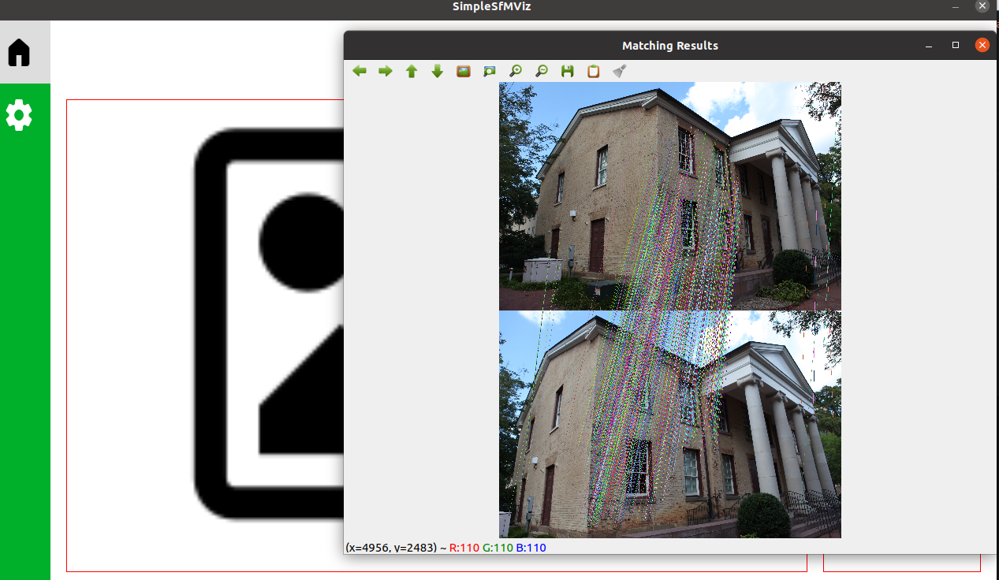
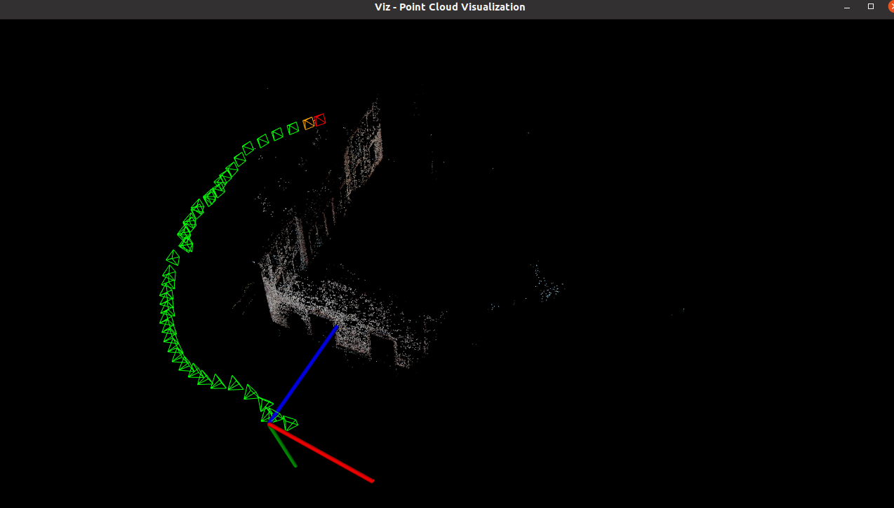
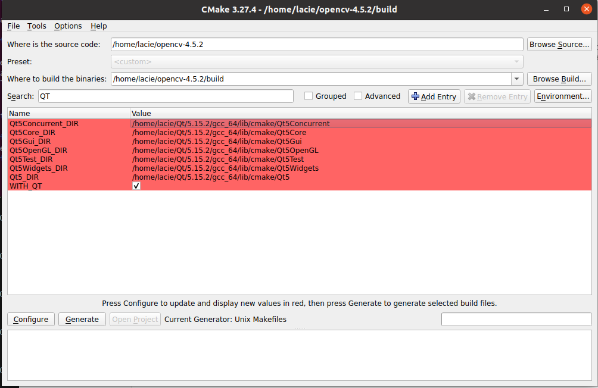

# SimpleSfMViz

<!-- [](https://github.com/acie-life/GreenHouseAR/actions/workflows/main.yml) -->

- [x] Point Cloud render by OpenGL
- [x] Mouse control view
- [x] Point Cloud + Color Render (PCLPointCloud2 + Qt3D Renderer) => quite stupid method
- [x] PCL PointCloud + OpenGL Render
- [x] Improve camera control interface
- [x] SfM plugin (GTSAM SfM/[SimpleSfM](https://github.com/lacie-life/visual-slam/tree/main/SfM))
- [ ] Update app Usage

## Dependencies

* OpenCV 4
* Ceres Solver 2.0
* Eigen3
* Qt5.15.2

## Build

```bash
mkdir build
cd build
cmake ..
make -j8
```

## Use case

- Record bag file screen
- Load bag file and process screen (with some config input)


## App demo






- <b> Config file format </b>

```yaml

images_path : "/home/lacie/Data/COLMAP/gerrard-hall/images"
database_path : "/home/lacie/Data/COLMAP/gerrard-hall/gerrard-hall.db"


SIFTextractor.max_image_size : 3200
SIFTextractor.num_features   : 8024
# 0 for L1_ROOT, 1 for L2, 2 for ROOT_SIFT
SIFTextractor.normalization  : 0

# 0 for sequential match, 1 for brute match, 2 for vacabulary tree match(not support now)
SIFTmatch.match_type :  0
# if descriptor is normalizing, then distance between two descriptors in range [0.0, 2.0].
# so, lower max distance with higher correct matches rate but less number of matcher, vice versa.
SIFTmatch.max_distance : 0.7
# distance_ratio may be from 0.5 to 1.0, lower distance ratio with higher correct matches rate but less number of matcher, vice versa.
SIFTmatch.distance_ratio : 0.8
# 0 for not use cross_check, 1 for use cross_check
SIFTmatch.cross_check : 1

#--------------------------------------------------------------------------------------------
# Camera Parameters. Adjust them!
#--------------------------------------------------------------------------------------------

# Camera calibration and distortion parameters (OpenCV) 
Reconstruction.Camera.fx: 3838.27
Reconstruction.Camera.fy: 3737.22
Reconstruction.Camera.cx: 2808
Reconstruction.Camera.cy: 1872

Reconstruction.Camera.k1: -0.110339
Reconstruction.Camera.k2: 0.079547
Reconstruction.Camera.p1: 0.000116211
Reconstruction.Camera.p2: 0.00029483


Reconstrction.output_path : "./gerrard-hall"
Reconstruction.is_visualization : 1
```

## Note 

- Careful with the `Qt3D` version, it may cause some error with `Qt` and `OpenCV` version



## References

[1] Snavely N, Seitz S M, Szeliski R. Photo Tourism: Exploring Photo Collections In 3D. Acm Transactions on Graphics, 2006, 25(3):págs. 835-846.

[2] Wu C. Towards Linear-Time Incremental Structure from Motion// International Conference on 3d Vision. IEEE Computer Society, 2013:127-134.

[3] Schönberger J L, Frahm J M. Structure-from-Motion Revisited// Computer Vision and Pattern Recognition. IEEE, 2016.

[4] [3dv_tutorial](https://github.com/mint-lab/3dv_tutorial)

[5] [Mastering OpenCV with Practical Computer Vision Projects](https://github.com/MasteringOpenCV/code/tree/master)

[6] [OpenCV Viz](https://docs.opencv.org/3.4/d7/df9/tutorial_table_of_content_viz.html)


