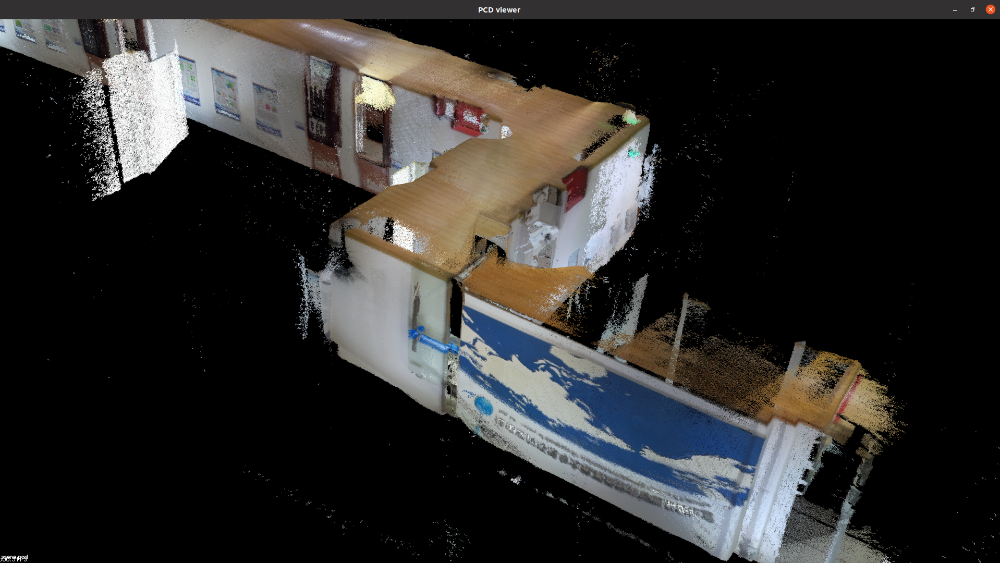
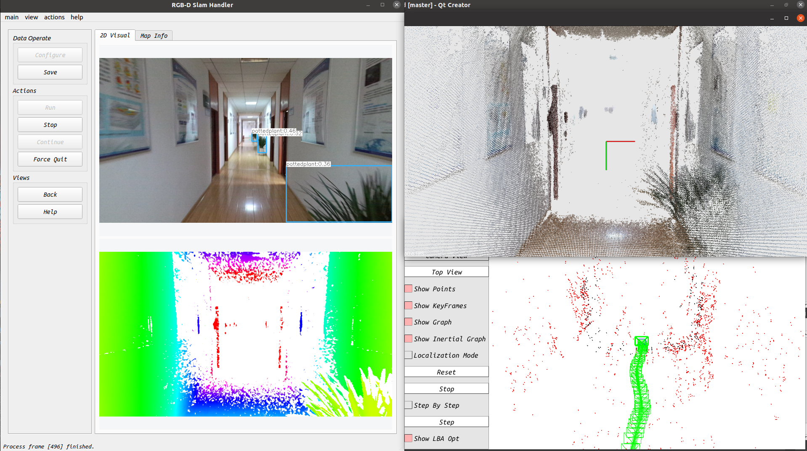
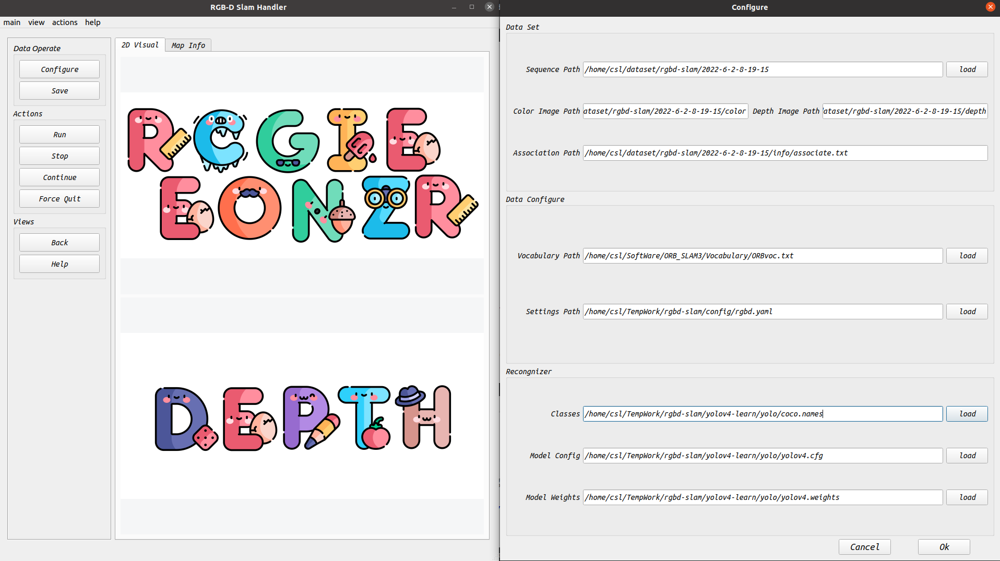
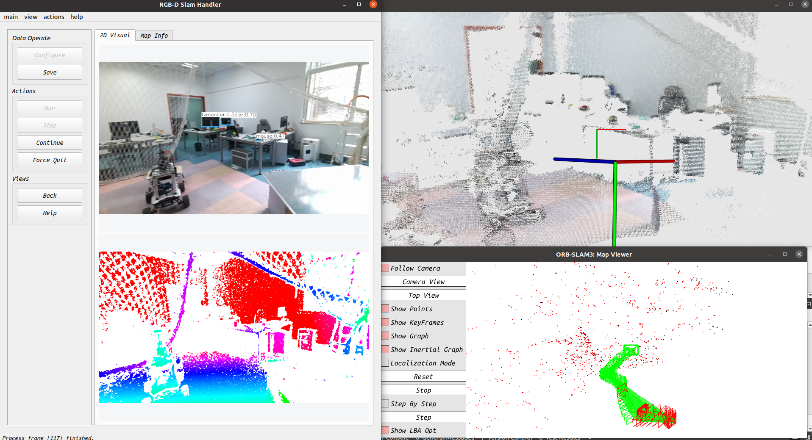
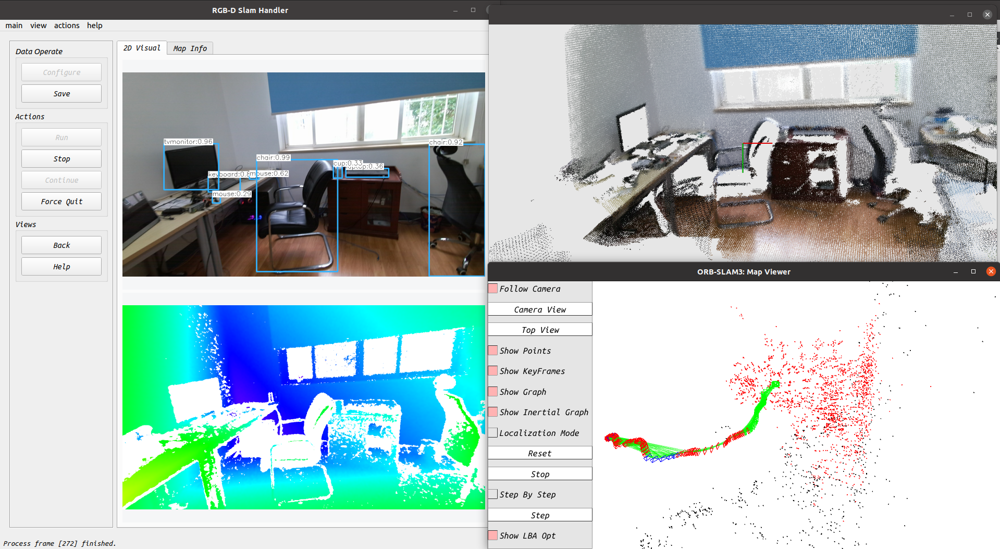
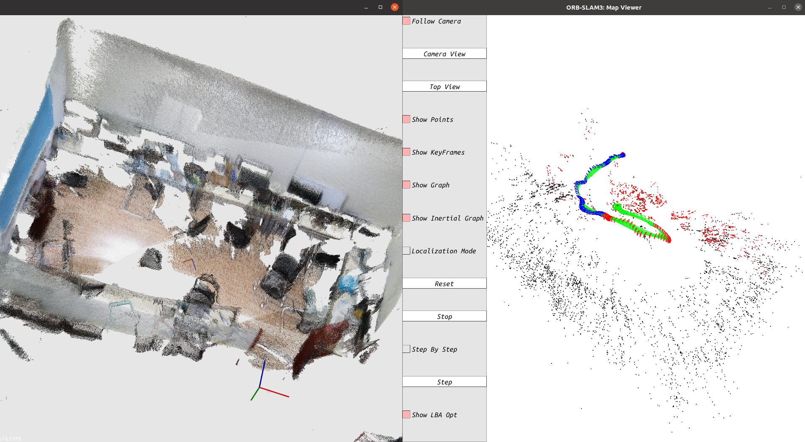

# QRGBD Handler

[TOC]

## 1. Author Info

```json
{
  "developers": [
    {
      "name": "shlChen",
      "e-mail": "3079625093@qq.com",
      "school": "Wuhan University"
    },
    {
      "name": "zrWang",
      "e-mail": "1298036718@qq.com",
      "school": "Wuhan University"
    },
    {
      "name": "yhZhao",
      "e-mail": "1163810660@qq.com",
      "school": "Wuhan University"
    },
    {
      "name": "qfWang",
      "e-mail": "871816589@qq.com",
      "school": "Wuhan University"
    }
  ]
}
```

## 2. Overview

​    **Slam** *(simultaneous localization and mapping), also known as* **CML** *(concurrent mapping and localization), real-time positioning and map construction, or concurrent mapping and positioning. The problem can be described as: put a robot into an unknown position in an unknown environment, and whether there is a way for the robot to gradually draw a complete map of the environment while moving. The so-called a consistent map refers to walking to every corner of the room without obstacles.*

​    **V-SLAM** *is a branch of slam. It takes the camera as the data acquisition equipment to locate and build maps in real time through relevant image and estimation optimization algorithms. Relying on a special camera rgbd camera, this project realizes slam software based on RGB image and depth image based on* **ORB-SLAM** *algorithm library,* **Yolo** *image recognition library and* **Open3D** *visualization library. It has the functions of location, scene recognition and scene reconstruction.*

​    *You can find("git clone") our project on GitHub:*

​    *[1]* **QRGBD-SLAM***:* [*https://github.com/Unsigned-Long/QRGBD-SLAM*](https://github.com/Unsigned-Long/QRGBD-SLAM)

​        Desktop software for processing image data and slam. That is, the software currently in use.


​    *[2]* **Kinect-Controller***:*  [*https://github.com/Unsigned-Long/kinect-controller*](https://github.com/Unsigned-Long/kinect-controller)

​        A data acquisition and control device based on Android, which communicates with the host through WiFi.


​    *[3]* **ROS-Kinect-Server:** [*https://github.com/Unsigned-Long/Ros-Kinect-Server*](https://github.com/Unsigned-Long/Ros-Kinect-Server)

​       It exists on the host (Ubuntu) and controls the server of Kinect camera through ROS, which is controlled by Android client.


## 3. Details

​    *The workflow of the developed system is shown in the figure below. The solution method used this time is post-processing. The main process consists of two parts:*

​    *1) Data acquisition: the Kinect camera is used to collect color images, depth images and IMU data at a certain frame rate. This         part is based on a small communication network composed of Ubuntu host, Android phone and Kinect camera. Through WiFi communication, Android phones send control signals to the Ubuntu host, receive data messages (including color images, depth images and IMU data) sent by the Ubuntu host, and display the data in real time on the user's Android selling price. The communication between Ubuntu and Kinect cameras is based on the ROS multi process communication mechanism. Specifically, Ubuntu will process the control messages sent by Android (such as start collection, stop collection, etc.) and convey them to the Kinect camera. The data collected by Kinect camera will be sent to Android via Ubuntu host for real-time display.*

​    *2) Data processing: that is, on Ubuntu, the qrgbd interface application developed based on QT is used to process and solve the collected data.*


​    **main interface thread**

​    *The main interface thread completes the configuration of data to be processed, interactive control of processing flow, display and output of processing results and other functions. Specifically, the main interface thread obtains the path of the corresponding data through the configuration dialog window and reads it into memory when processing begins. At the beginning of processing, the data frame is sent to the slam thread at a certain frame rate to complete the slam process of the current frame and obtain the current pose. Then the pose and data frame are sent to the reconstruction thread for scene reconstruction. At the same time, when the recognition thread is idle, the color image is sent to the recognition thread for object recognition, and the marked image is obtained and displayed.*

​    **slam thread**

​    *Slam threads rely on the orb-slam3 library. When the main thread passes in the data frame, it performs the slam solution of the data frame. If the system has not been initialized, it will be initialized and then tracked. When the trace is lost, the slam system will try to relocate. If it fails, it will be reinitialized. After the related work is completed, the thread will return the calculated pose results to the main thread.*

​    **identifying thread**

​    *Identifying threads relies on the yolo3 library.*

​    **rebuilding thread**

​    *The reconstruction thread completes the remapping of depth map and the reconstruction of 3D scene. Since 3D scene reconstruction takes a lot of time, it is put into the sub thread of the reconstruction thread:*

​    *1) Remapping of depth map: depth information of corresponding position pixels recorded in depth image acquired by rgbd camera. Because it is a single channel image, it is converted to a three channel RGB color image through remapping. After the remapping is completed, the resulting color image is returned to the main thread for visualization.*

​    *2) 3D scene reconstruction: it relies on PCL library and is completed in sub threads. When the reconstruction thread converts the pixels on the depth map to the world coordinate system with the help of pose information and depth information, the point cloud data is obtained and sent to the 3D scene reconstruction sub thread. The 3D scene reconstruction sub thread visualizes the point cloud in an incremental manner. The 3D scene reconstruction sub thread has two visualization modes: interactive visualization and rendering visualization:*

​        *a) Interactive visualization: when the slam is completed or terminated, the interactive visualization mode is enabled. Users can manipulate the PCL point cloud window through the mouse to view the point cloud from multiple angles and levels;*

​        *b) Rendering visualization: when slam is performed, the PCL window is performed in a rendering visualization manner. Specifically, visualize the point cloud to be incrementally visualized in each frame, track the position of the camera, and change the viewport to simulate the perspective during data collection.*

## 4. RunTime

